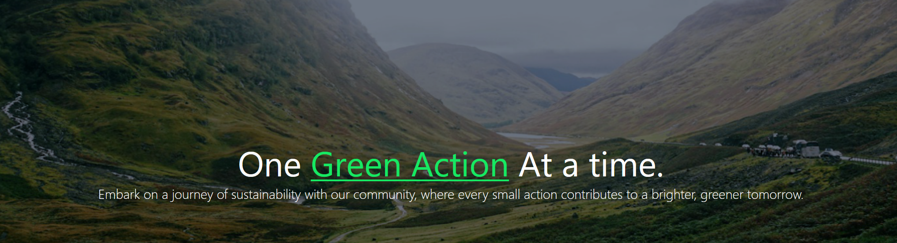

# About Green Actions 
The project is placing a strong emphasis on sustainability and engaging every user in taking meaningful actions. 
Where individuals or companies can:
- Explore valuable insights on sustainability practices.
- Track their contributions towards reducing their carbon footprint.
- Engage in friendly competition with others.
- Receive the GreenStatus badge once 100 points are collected.

Navigate to [Screenshots](./media/screenshots.md) to view what the website looks like.

 

## Installation
- Clone the repo.
- Open the project in Visual Studio Code.
- Execute the following commands in the Terminal:
     - `composer install` to install Composer.
     - `composer require laravel/installer`  to install Laravel.
     - `copy .env.example .env` to generate `.env` file.
     - Adjust `.env` for your Database settings (like the `DB_DATABASE` field).
     - `php artisan key:generate` to generate encryption key.
     - `php artisan migrate` to generate DB tables.
     - `php artisan serve` to start the server/website.

#### Requirments
Requires [XAMP](https://www.apachefriends.org/download.html) for the database, or the following libraries/technologies to run:
- Apache.
- MySQL.

 

## Disclaimer
The project mimics "Forgot Password" functionality and the payment process, meaning it will not send a password-reset link to emails, and there is no real payment being used.
 

## License

The GreenActions project is open-sourced software licensed under the [MIT license](LICENSE.md).

